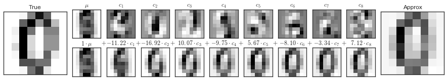
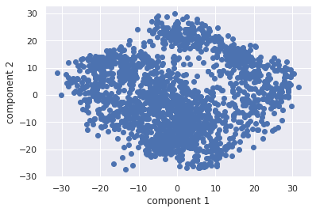
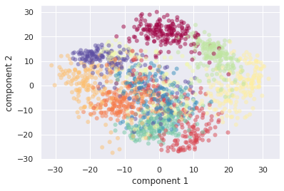
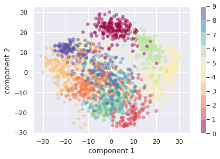
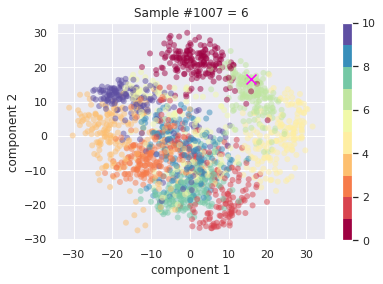
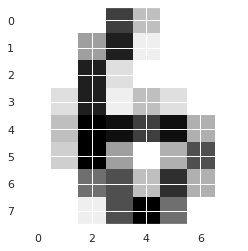

# Weekly Project 8
For this project, we'll take a breif look at a very powerful statistical method in Data Science - Principle Component Analysis (PCA).  PCA is used often used to categorize and help classify data samples, and we will leverage it to build a rudimentary classification system for hand-written numeric digits.  The key behind PCA is it allows you to take complex data, and plot it along just a few abstract axis - which can be more easily visualized.  We will take complex data (8x8 pixel data - meaning 64 pixels for each image) and plot them along just 2 axis.  Leveraging `matplot.lib`, we'll color code the data points by the underlying digit in the image - revealing how well (and how noisy!) the pixel data can be used to guess at which number has been written.  The value in this is that we can then take a *new hand written digit* and apply PCA to plot it against our *training data* to make a visual guess at it's classification.  While there is far, far more to computer vision and machine learning - this project illustrates some of the key aspects of these technologies.

We will use `scikitlearn` in this project to provide two things: (1) a PCA implementation, so we don't need to do it ourselves, and (2) the hand writing data set - which is a standard data set used by many researchers.

## Learning more about PCA
You are going to learn a lot about PCA in other classes, but if you should really take a look at the following explanations, so you can understand what is going on in this project:
- [https://www.stat.cmu.edu/~cshalizi/350/lectures/10/lecture-10.pdf](https://www.stat.cmu.edu/~cshalizi/350/lectures/10/lecture-10.pdf)
- [https://jakevdp.github.io/PythonDataScienceHandbook/05.09-principal-component-analysis.html](https://jakevdp.github.io/PythonDataScienceHandbook/05.09-principal-component-analysis.html)
- https://towardsdatascience.com/pca-using-python-scikit-learn-e653f8989e60

## Learning more about `scikitlearn`
We are going to be taking a closer look at this library later in the semester - feel free to look ahead in the syllabus and text for some more information.  You will also learn a great deal about this if you elect to take the Machine Learning course.

## The Digits Dataset
*The following steps should be taken as part of a jupyter notebook.*

We are going to be working with the `digits` data set that is distributed with scikit. Towards the top, load the digits data:

```python
from sklearn.datasets import load_digits
digits = load_digits()
digits.data.shape
```
The output of the shape call should be (1797, 64).  The data set contains 1797 sample images of hand drawn digits - each 8x8 pixels - stored as a linear array of 64 floating point values.  



You should inspect the data.  You'll find that in addition to the `data` property - which is what we'll use PCA on - there is a `target` array.  This has 1797 numbers - one for each sample in the `data` property.  This is "the answer" - the intended digit.  Think of this as labels in Machine Learning  training set.  We will be working with PCA to start a process of having python determine (from the data only) which digit is being represented - but the `target` array contains the correct answer.

## Applying PCA
Next, you'll import the PCA module from `sklearn`.  You can find detailed documentation here:

- [https://scikit-learn.org/stable/modules/generated/sklearn.decomposition.PCA.html](https://scikit-learn.org/stable/modules/generated/sklearn.decomposition.PCA.html)


```python
from sklearn.decomposition import PCA
```


Since ultimately we will be collapsing the 64-dimensional (8x8) data for each image into a 2D space to plot, initialize an `pca` instance to have 2 components.

The next step is to provide the data to the pca module to accomplish two things:
1. Fit the data - which performs the PCA analysis to uncover the best linearly orthoganal vectors to act as our two dimensional space.
2. Project (transform) the actual data into the new 2D space.

You'll want to do this with the [`fit_transform` function](https://scikit-learn.org/stable/modules/generated/sklearn.decomposition.PCA.html#sklearn.decomposition.PCA.fit_transform).  You can simply supply it with the `digits.data` value - and it will return two 1797 element vectors to you - which represent each of the 64 pixel images projected onto a 2D space.

## Plotting the transformed results
One of the troubling parts of PCA analysis is that the mapping to this 2D space doesn't really leave you with a lot of intuition.  To start to see what PCA has done for us however, let's turn to a scatter plot using `matplot.lib`.  Create a [scatter plot](https://matplotlib.org/3.1.0/api/_as_gen/matplotlib.pyplot.scatter.html), with the results returned from `fit_transform` - where the 1st vector are the X components of each data point, and second are the Y components

You should get something like this:



Well... not quite that interesting yet.  The problem is that we are plotting all 1797 data points onto an arbitrary space - but we don't know which digits are where - so there is nothing interesting to see.  Yet.

As a next step, augment the construction of your scatter plot to assign a specific color to each data point, based on which actual digit (0-9) it really is. You can do this by using color indexing and color maps.  The scatter constructor accepts a parameter called `cmap`, which is a color map containing all the colors you want to use.  Set this value to `plt.cm.get_cmap("Spectral", 10)` - which builds a color map across the color spectrum - with 10 basic colors.  In addition, the scatter constructor accepts a color index array - which lets you instruct it which color index (within the color map) to assign each data point.  Since our color map has 10 entries (0-9), this lines up perfectly with the `digits.targets` array - so pass that in as the `c` parameter.  Since the data points overlap eachother, you should also set the `alpha` parameter to 0.5 so there is some transparency.  Setting `edgecolor='none'` also improves readability of the scatter plot.

You should get something like this:



Something is clearly going on here... there are fairly distinct clouds of colors - suggesting that PCA is actually doing something pretty neat - it is classifying the samples!  Our next step is to understand which colors are being mapped to which numbers - so we can start to reason about by some clouds are distinct, and what their placement might suggest.  

Got ahead and add a `colorbar` to the plot - which will provide a mapping between the colors used in the plot and their actual numbers:

```python
plt.colorbar();
```

Now you should see this:



Can you reason about this a bit?  You can see the 0 samples are really concentrated up top, and pretty distinct (far away) from other numbers aside from 6.  This sort of makes sense, if the samples are somewhat sloppy, it's not suprising a  6 could look like a 0, and vice-versa - the digits aren't that different.  Look how far away 0 and 1 are though - which also makes sense - they look nothing alike.  Can you spot other pattersn here?  Which digit is the hardest to distinguish?

## Experimenting with Results
In order to fully see what is happening, let's look at a few random samplings.  

Create a new cell, and compute a random index between 0 and the length of the `digits.target` array (1797).  Obtain the data associated with that sample idex (`digits.data[sample_index]`) and call the `transform` function for `pca`.  The transform function does not re-fit the PCA components, it simply maps the given data to the already computed components.  Clearly this sample was part of the original fitting process, but now we can look at it individually.

Now create a new scatter plot with two data sets.  The first is the same as before - with all the same color options.  The next is a plot with just the new sample.  This part is tricky, because you need to make sure this scatter plot uses the same `cmap` as the first.  The second scatter has just one x,y coordinate - the sample data transformed by PCA.  Use a different color so it stands out, and use a different marker (i.e. 'x') with a scale (`s` parameter) fairly large.

Plotting sample 1007 would look like this:



You can display the image itself using the `image` property on digits.

```
plt.imshow(digits.images[sample_index], cmap=plt.cm.binary, interpolation='nearest') 
```



Go ahead and try other samples!